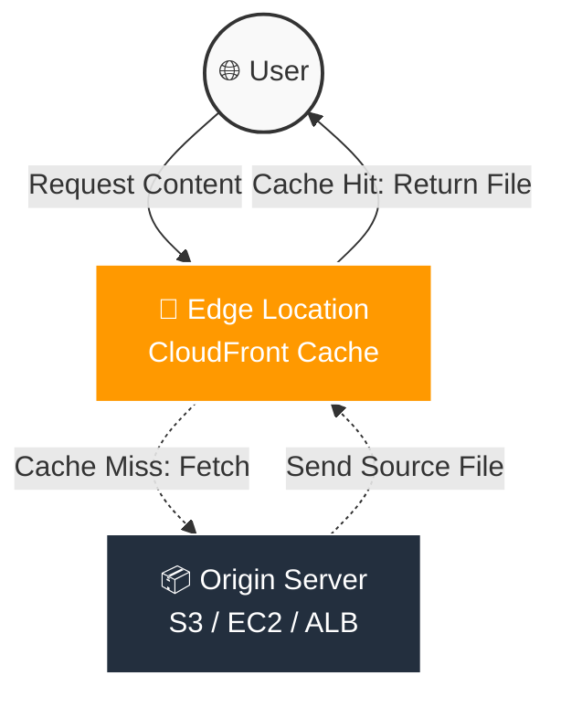

# 🌍 AWS CloudFront

## 📚 Complete CloudFront Guide (Beginner → Intermediate → Practical)
### ⚡ Content Delivery Network (CDN) service in AWS

---

## 🔹 What is CloudFront?
Amazon CloudFront is a Content Delivery Network (CDN) service provided by AWS.

It helps deliver content globally with:

Low latency
High speed
Better performance
Enhanced security

---

## 🔹 Why CloudFront is Needed?
CloudFront helps organizations:

Deliver content faster
Reduce server load
Improve website performance
Secure applications
Cache static content globally

---

## 🔹 What Content Can CloudFront Deliver?
HTML
CSS
JavaScript
Images
Videos
APIs
Application files

---

## 🔹 Core Components

### 🔹 `Distribution`
A Distribution is the main CloudFront configuration.

Types:

Web Distribution
RTMP Distribution (Legacy)

### 🔹 `Origin`
Origin is the backend source from where CloudFront fetches content.

Examples:

Amazon S3
EC2 Instance
Application Load Balancer
Nginx Server
External Server

### 🔹 `Edge Locations`
AWS global locations where content is cached.

Benefits:

Faster delivery
Reduced latency
Better user experience

### 🔹 `Cache`
CloudFront stores cached content at edge locations.

Benefits:

Faster response
Reduced backend traffic
Reduced server load

### 🔹 `Cache Behavior`
Defines how CloudFront handles requests.

Includes:

Path patterns
Cache rules
HTTP methods
Protocol policies

---

## 🔥 How CloudFront Works
User Request
      ↓
Nearest Edge Location
      ↓
Cached Content Available?
      ↓
YES → Return Cached Content
NO  → Fetch from Origin
      ↓
Cache Content
      ↓
Return Response

---

## 🔥 CloudFront Workflow



#### 🖼️ Architecture Diagram:


---

## 🔥 CloudFront with S3
Most common use case.

Flow:

User
   ↓
CloudFront
   ↓
S3 Bucket

Benefits:

Static website hosting
Global caching
Secure access

---

## 🔥 CloudFront with EC2
CloudFront can distribute applications hosted on EC2.

Flow:

User
   ↓
CloudFront
   ↓
EC2 + Nginx/Apache

---

## 🔥 CloudFront with Load Balancer
Used for scalable production applications.

Flow:

User
   ↓
CloudFront
   ↓
Application Load Balancer
   ↓
EC2 Instances

---

## 🔹 Viewer Protocol Policies
Defines HTTP/HTTPS behavior.

Options:

| Policy | Description |
| :--- | :--- |
| HTTP Only | Only HTTP allowed |
| HTTPS Only | Only HTTPS allowed |
| Redirect HTTP to HTTPS | Automatically redirects |

---

## 🔹 CloudFront Caching
CloudFront caches:

Static files
Images
APIs
Videos

---

## 🔹 Cache TTL
TTL = Time To Live

Defines how long content remains cached.

Types:

Minimum TTL
Default TTL
Maximum TTL

---

## 🔥 CloudFront Security Features
HTTPS Encryption
SSL/TLS Certificates
AWS Shield Protection
AWS WAF Integration
Signed URLs
Signed Cookies
Geo Restriction

---

## 🔐 SSL/TLS in CloudFront
CloudFront supports HTTPS using ACM certificates.

### 🔹 `ACM (AWS Certificate Manager)`
Used to create SSL certificates.

Example Domains:

example.com
*.example.com

### 🔹 `Alternate Domain Names (CNAME)`
Custom domains can be attached.

Example:

example.com
www.example.com

### 🔹 `Geo Restriction`
Restrict users based on country.

Options:

Whitelist
Blacklist

---

## 🔥 CloudFront Pricing Factors
Pricing depends on:

Data Transfer
HTTP Requests
HTTPS Requests
Geographic Location
Cache Invalidations

---

## 🔥 CloudFront Logging
CloudFront supports access logging.

Logs can be stored in:

Amazon S3

---

## 🔥 Monitoring with CloudWatch
CloudFront integrates with CloudWatch.

Monitor:

Requests
Errors
Latency
Cache Hit Ratio

---

## 🔄 CloudFront Integrations
CloudFront integrates with:

Amazon S3
EC2
ALB
Route 53
AWS WAF
Lambda@Edge
API Gateway

---

## 🔄 `Lambda@Edge`
Run Lambda functions closer to users.

Use Cases:

Header modification
Authentication
Redirects
Content customization

---

## 🔥 CloudFront Invalidations
Used to clear cached files.

### 🔹 Example Invalidation Path
`/*`

### 🔹 AWS CLI Command
```bash
aws cloudfront create-invalidation \
--distribution-id DISTRIBUTION_ID \
--paths "/*"
```

---

## 🔥 CloudFront Access Control

### 🔹 `Origin Access Control (OAC)`
Secure S3 bucket access through CloudFront only.

### 🔹 `Signed URLs`
Used to provide temporary access to private files.

### 🔹 `Signed Cookies`
Used for restricted content access.

---

## 🔥 Common CloudFront Errors

| Error | Cause |
| :--- | :--- |
| 403 Forbidden | Permission issue |
| 404 Not Found | File missing |
| SSL Error | Invalid certificate |
| CNAME Error | DNS issue |
| Origin Error | Backend unreachable |

---

## ⚠️ Common Mistakes
No cache invalidation
Wrong DNS records
Invalid SSL certificate
Improper cache settings
Public S3 bucket exposure

---

## 🔒 Best Practices
Use HTTPS Only
Enable Compression
Configure Cache Properly
Use AWS WAF
Enable Logging
Restrict S3 Access
Use ACM Certificates

---

## 🧪 Practical Steps

### 🔹 Create CloudFront Distribution

#### Step 1
Open:

AWS Console → CloudFront

#### Step 2
Click:

Create Distribution

#### Step 3
Add Origin Domain

Example:

`mybucket.s3.amazonaws.com`

#### Step 4
Configure Cache Behavior

Set:

Redirect HTTP to HTTPS

#### Step 5
Add Alternate Domain Name

`example.com`

#### Step 6
Attach ACM SSL Certificate

#### Step 7
Create Distribution

### 🔹 Configure DNS
Add CNAME in Route 53 or Namecheap.

Example:

`example.com` → `d123abcd.cloudfront.net`

---

## 🔥 Useful AWS CLI Commands

#### List Distributions
```bash
aws cloudfront list-distributions
```

#### Get Distribution Details
```bash
aws cloudfront get-distribution \
--id DISTRIBUTION_ID
```

#### Create Invalidation
```bash
aws cloudfront create-invalidation \
--distribution-id DISTRIBUTION_ID \
--paths "/*"
```

---

## 🏆 Interview Questions
What is CloudFront?
What is CDN?
What are Edge Locations?
Difference between S3 and CloudFront?
What is cache invalidation?
What is Origin?
What is OAC?
What is Signed URL?
Difference between Route 53 and CloudFront?

---

## 💡 Quick Revision
CloudFront = CDN Service
Origin = Backend Source
Edge Location = Cache Server
TTL = Cache Time
Distribution = CloudFront Setup
OAC = Secure S3 Access
Invalidation = Clear Cache

---

## 🎯 Final Concept
Amazon CloudFront is a global CDN service that improves performance, reduces latency, secures applications, and delivers content faster using AWS Edge Locations and intelligent caching mechanism.
