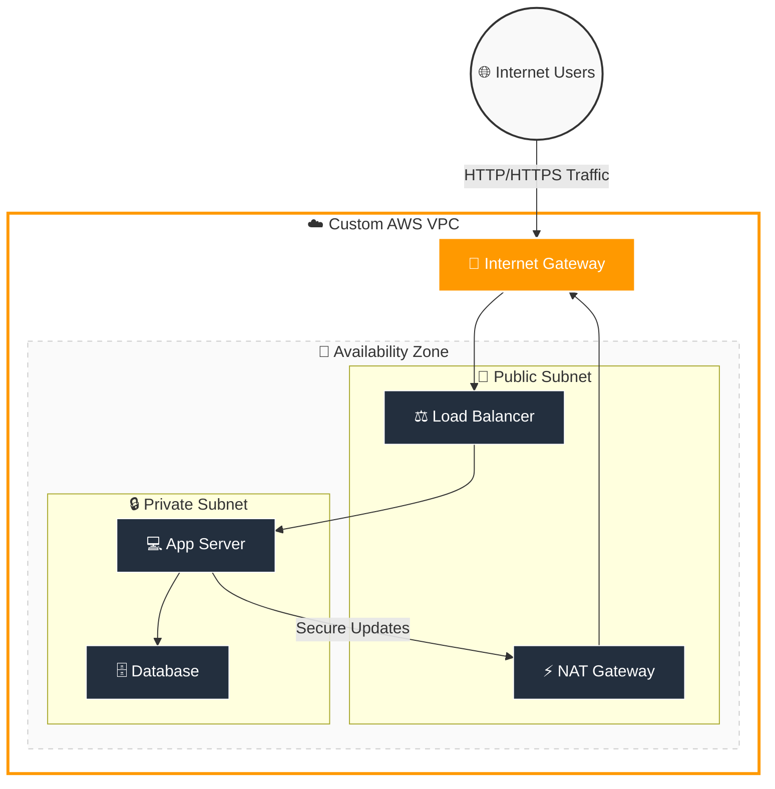

# 🌐 AWS VPC (Virtual Private Cloud)

## 📚 Complete VPC Guide (Beginner → Intermediate → Practical)
### ⚡ Networking Service in AWS

---

## 🔹 What is VPC?
Amazon VPC (Virtual Private Cloud) is a logically isolated virtual network in AWS where you can launch AWS resources securely.

👉 It helps you:

Handle high traffic
Improve availability
Reduce downtime
Optimize cost

---

## 🔹 Why VPC is Needed?
Network isolation
Secure communication
Full control over IP ranges
Connect cloud with on-premises network

---

## 🔹 Core Components

### 🔹 `Subnet`
A subnet is a smaller network inside a VPC.

Types:

Public Subnet
Private Subnet

### 🔹 `Public Subnet`
Connected to Internet Gateway
Internet accessible
Examples:

Web servers
Load balancers

### 🔹 `Private Subnet`
No direct internet access
Examples:

Databases
Backend servers

### 🔹 `Route Table`
Controls network traffic inside VPC.

Contains:

Destination
Target

Example:

0.0.0.0/0 → Internet Gateway

### 🔹 `Internet Gateway (IGW)`
Allows communication between VPC and internet.

Used for:

Public internet access

### 🔹 `NAT Gateway`
Allows private subnet instances to access internet without exposing them publicly.

Used for:

Updates
Package downloads

### 🔹 `Security Group`
Acts like a virtual firewall at instance level.

Controls:

Inbound traffic
Outbound traffic

### 🔹 `Network ACL (NACL)`
Acts as subnet-level firewall.

Features:

Stateless
Allow/Deny rules

### 🔹 `Elastic IP`
Static public IP address.

Used with:

NAT Gateway
EC2 instances

---

## 🔥 VPC Architecture



#### 🖼️ Architecture Diagram:


---

## 🔥 Default VPC
AWS provides a default VPC in every region.

Features:

Public subnets
Internet access enabled

---

## 🔥 Custom VPC
User-created VPC with custom networking configuration.

Benefits:

Better security
Full control
Production ready

---

## 🔥 Create VPC Using AWS Console
Open VPC Dashboard
Click Create VPC
Add CIDR block
Create subnets
Attach Internet Gateway
Configure Route Tables
Configure Security Groups

---

## 🔥 Create VPC Using AWS CLI

### Create VPC
```bash
aws ec2 create-vpc --cidr-block 10.0.0.0/16
```

### Create Subnet
```bash
aws ec2 create-subnet \
--vpc-id vpc-12345678 \
--cidr-block 10.0.1.0/24
```

### Create Internet Gateway
```bash
aws ec2 create-internet-gateway
```

### Attach Internet Gateway
```bash
aws ec2 attach-internet-gateway \
--vpc-id vpc-12345678 \
--internet-gateway-id igw-12345678
```

---

## 🔥 CIDR Block
CIDR defines IP address range.

Examples:

10.0.0.0/16
192.168.1.0/24

---

## 🔥 Public vs Private Subnet
Feature	Public Subnet	Private Subnet
Internet Access	Yes	No
IGW Connected	Yes	No
Use Case	Web Server	Database

---

## 🔥 Security Group vs NACL
Security Group	NACL
Stateful	Stateless
Instance Level	Subnet Level
Allow Rules Only	Allow & Deny

---

## 🔥 NAT Gateway
Used by private subnet instances to access internet securely.

Example:

Install packages
Download updates

---

## 🔥 VPC Peering
Connects two VPCs privately.

Benefits:

Internal communication
Multi-VPC architecture

---

## 🔥 VPC Endpoints
Allows private connection between VPC and AWS services.

Examples:

S3 Endpoint
DynamoDB Endpoint

Benefits:

No internet needed
More secure

---

## 🔥 VPN Connection
Used to connect:

On-premises network
AWS VPC

Types:

Site-to-Site VPN
Client VPN

---

## 🔥 Transit Gateway
Central hub for connecting:

Multiple VPCs
VPNs
On-premises networks

---

## 🔥 Flow Logs
Captures network traffic logs in VPC.

Used for:

Monitoring
Troubleshooting
Security analysis

---

## 🔥 High Availability Best Practice
Deploy resources across:

Multiple Availability Zones (AZs)

Benefits:

Fault tolerance
High availability

---

## 🔥 Common Ports
Service	Port
SSH	22
HTTP	80
HTTPS	443
MySQL	3306

---

## 🔄 Real Use Cases
Multi-tier applications
Kubernetes networking
Secure database architecture
Hybrid cloud connectivity

---

## ⚠️ Common Mistakes
Using public subnet for database
Wrong route table configuration
Opening all ports to internet
Missing NAT Gateway for private subnet

---

## 🔒 Best Practices
Use private subnets for databases
Enable flow logs
Use least privilege security rules
Deploy across multiple AZs
Use NAT Gateway securely

---

## 🏆 Interview Questions
What is VPC?
Difference between public and private subnet?
Difference between Security Group and NACL?
What is NAT Gateway?
What is Internet Gateway?
What is VPC Peering?

---

## 🧪 Troubleshooting Commands

### Describe VPCs
```bash
aws ec2 describe-vpcs
```

### Describe Subnets
```bash
aws ec2 describe-subnets
```

### Describe Route Tables
```bash
aws ec2 describe-route-tables
```

### Describe Security Groups
```bash
aws ec2 describe-security-groups
```

---

## 💡 Quick Revision
VPC = Private Network
Subnet = Small Network
IGW = Internet Access
NAT = Private Internet Access
Security Group = Instance Firewall
NACL = Subnet Firewall

---

## 🎯 Final Concept
Amazon VPC is a secure and isolated virtual network service in AWS that helps organizations build scalable, secure, and highly available cloud infrastructure with complete control over networking and traffic flow.
